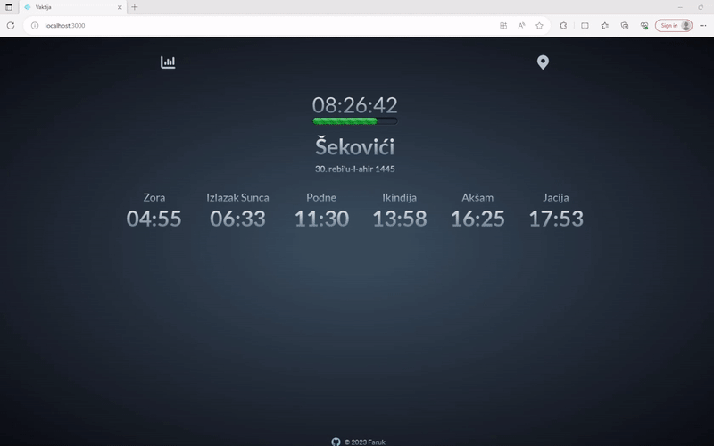

# **vaktija-api project**

## Deployed live version:
- [vaktija-api]()

## Description

In the beginning the idea was just to display timestamps for 5 daily prayers using vaktija.ba API. Later on I expanded this project with 2 charts to display time differences between prayers on daily and yearly basis, afterward, I also added a component to find any date in the range from year 1937 to 2077 and to look up what was the lunar date or what lunar date will be in the future

## Basic featuers of this app:

- Daily prayer times overview for cities in BiH. 
- Duration of 5 daily prayers shown through a diagram.
- Get any date in a range from year 1937 - 2077 and show the lunar date equivalent.

## This project uses the following technologies:

- [React](https://reactjs.org) fronted
- [Context API](https://react.dev/learn/scaling-up-with-reducer-and-context) for state management between React components
- [date-fns](https://date-fns.org/) date utility library for date management

### To get a local copy up and running, follow these steps:

1.  Clone the repository using your terminal: `git clone https://github.com/FarukC5/vaktija-api`

2.  Navigate to vaktija-api folder, and run `npm install` to install NPM packages. Then, run `npm start` to start this app.
